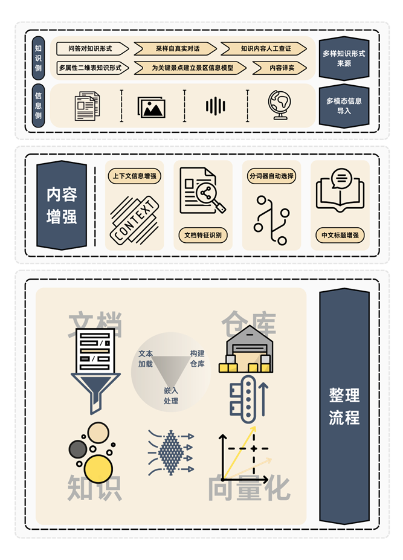
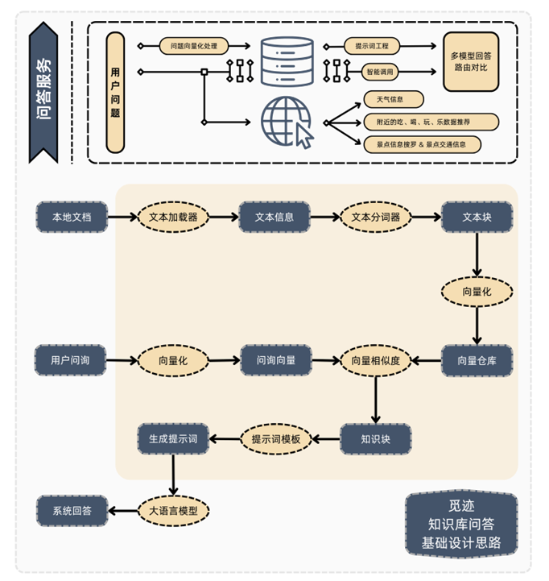
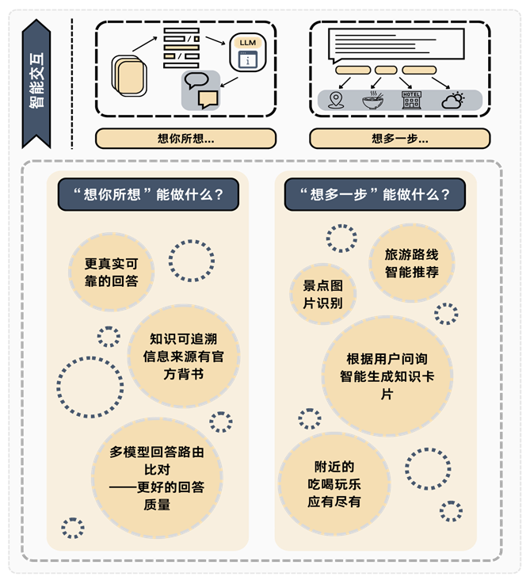

# MIJI觅迹 - 杭州文旅智能问答系统

<div align="center">

**基于 LangChain 的 RAG (检索增强生成) 文旅问答助手**

[](https://langchain.com/)
[](https://www.python.org/)


</div>

```HTML
<video width="320" height="240" controls>
    <source src="assets\觅迹项目展示视频.mp4" type="video/mp4">
</video>
```


## 🎯 项目简介

**觅迹**是一个专注于杭州文化旅游的智能问答系统,通过 RAG (Retrieval-Augmented Generation) 技术,结合大语言模型和知识库检索,为用户提供准确、全面的杭州文旅信息查询服务。

### 行业痛点

- **信息碎片化**: 文旅信息分散在多个平台,难以统一获取
- **查询效率低**: 传统搜索无法理解用户真实意图
- **内容不够深入**: 简单的关键词匹配无法满足个性化需求
- **缺乏智能推荐**: 无法根据用户偏好提供定制化建议

### 竞品分析

本项目在以下方面具有优势:
- ✅ 多样化知识源整合(文本、图片、音频、视频)
- ✅ 多轮对话上下文理解
- ✅ 知识追溯与来源标注
- ✅ 个性化推荐能力

---

## ✨ 核心特色

### 1. 智能识别 - 多样知识识别

**支持多种知识类型识别与处理:**

- 📄 **文档识别**: 支持 PDF、Word、Markdown 等格式
- 🖼️ **图像识别**: 景点图片、地图、信息图表
- 🎵 **音频识别**: 语音导览、口述历史
- 🎬 **视频识别**: 旅游宣传片、纪录片内容提取

**处理流程:**


### 2. 内容增强 - 多维度内容扩充

**四大增强策略:**

| 策略           | 说明                       |
| -------------- | -------------------------- |
| 🔼 上下文值增强 | 通过上下文关联扩展知识边界 |
| 🔍 分词质量筛选 | 智能分词提高检索精度       |
| 📝 文档框架识别 | 理解文档结构,精准定位信息  |
| 💬 串文档展解说 | 跨文档关联,提供全面解答    |

### 3. 整理流程 - 知识处理管线



**处理阶段:**
1. 📥 **文档加载**: 多格式文档统一处理
2. 🏗️ **构建仓库**: 结构化知识存储
3. 🔄 **向量化**: 文本嵌入向量化
4. 🧠 **知识提取**: 关键信息抽取与组织

---

## 🏗️ 技术架构

### 核心框架: LangChain

基于 LangChain 框架构建,充分利用其模块化设计和丰富的组件生态。

### 系统架构图

#### 1️⃣ 跨域细节架构



#### 2️⃣ 觅迹知识库问答基础设计思路

**完整处理流程:**

```
本地文档 → 文本加载器 → 文本信息 → 文本分词器 → 文本块
                                              ↓
用户问询 → 向量化 → 问询向量 → 问询相似度 → 问题合库
              ↓                                ↓
         生成展示词 ← 单示词模版 ← 知识块
              ↓
         系统回答
```

**关键组件:**
- **文本加载器**: 统一处理各类文档格式
- **文本分词器**: 智能切分文本,保持语义完整
- **向量化引擎**: 将文本转换为高维向量
- **相似度计算**: 快速检索最相关知识
- **提示词模板**: 优化大模型输入格式
- **生成展示**: 结构化输出答案

### 数据流向

```
Input → Retrieval → Augmentation → Generation → Output
  ↓         ↓            ↓              ↓          ↓
用户问题  知识检索     上下文增强    内容生成   最终答案
```

---

## 🎨 功能模块

### 🔍 回答能力 - "想你所想"

**核心功能:**

1. **更真实可靠的回答**
   - 基于权威知识库,确保答案准确性
   - 支持来源追溯,可验证信息真实性

2. **知识可追溯,信息来源有首方背书**
   - 每个答案都标注知识来源
   - 支持一键查看原始文档

3. **多模型回答路由比对**
   - 调用多个大语言模型
   - 自动选择最优答案质量

### 🚀 进阶能力 - "想多一步"

**智能推荐功能:**

| 功能                         | 说明                           |
| ---------------------------- | ------------------------------ |
| 🗺️ **旅游路线智能推荐**       | 根据用户偏好生成个性化路线     |
| 🖼️ **景点图片识别**           | 上传图片即可识别景点并提供详情 |
| 🎴 **智能生成知识卡片**       | 根据用户问询自动生成结构化卡片 |
| 🎯 **附近的吃喝玩乐应有尽有** | 基于地理位置的全方位推荐       |


---

## 🙏 致谢

感谢以下开源项目:

- [LangChain](https://github.com/langchain-ai/langchain) - RAG 框架
- [Zhipu](https://bigmodel.cn/) - Zhipu大语言模型 API
- [HuggingFace](https://huggingface.co/) - 模型和工具
- [FastAPI](https://fastapi.tiangolo.com/) - Web 框架

---

<div align="center">

**⭐ 如果这个项目对你有帮助,请给我们一个 Star! ⭐**

Made with ❤️ by Miji Team

</div>
